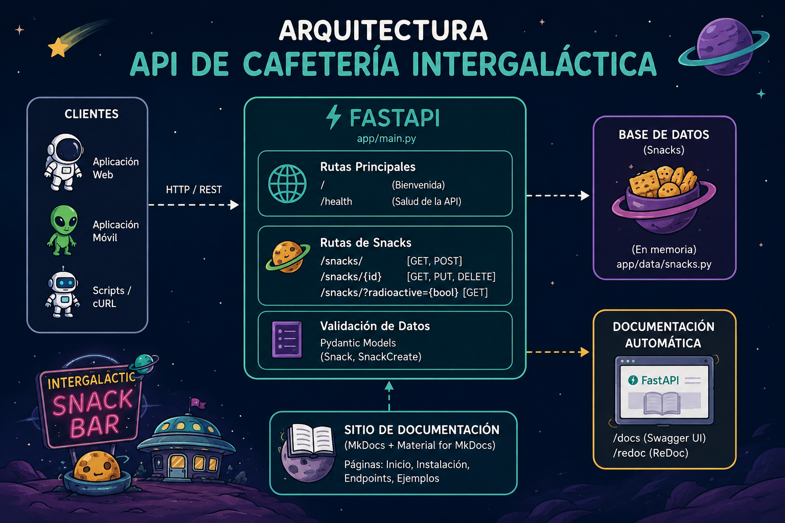

# API de Cafetería Intergaláctica

Bienvenido a la documentación oficial de la **API de Cafetería Intergaláctica**.

Este proyecto es una API REST de ejemplo desarrollada con **Python** y **FastAPI**. Su propósito es administrar bocadillos vendidos a astronautas, extraterrestres, robots y otros viajeros espaciales hambrientos.

## Características principales

| Característica | Descripción |
|---|---|
| Listar bocadillos | Devuelve todos los bocadillos disponibles |
| Buscar por ID | Devuelve un bocadillo específico |
| Crear bocadillos | Agrega un nuevo bocadillo al menú |
| Actualizar bocadillos | Modifica la información de un bocadillo |
| Eliminar bocadillos | Elimina un bocadillo del menú |
| Filtrar por radiación | Filtra los bocadillos según su estado radioactivo |

## Tecnologías utilizadas

El proyecto utiliza las siguientes tecnologías:

- Python
- FastAPI
- Uvicorn
- Pydantic
- MkDocs
- Material for MkDocs

## Objetivo del proyecto

El objetivo de este proyecto es demostrar cómo crear una API sencilla con FastAPI y cómo documentar su instalación, endpoints y ejemplos de uso mediante MkDocs.

## Navegación

Consulta la [guía de instalación](installation.md) para configurar y ejecutar el proyecto localmente.

También puedes revisar los [endpoints disponibles](endpoints.md) o consultar los [ejemplos de solicitudes](examples.md).